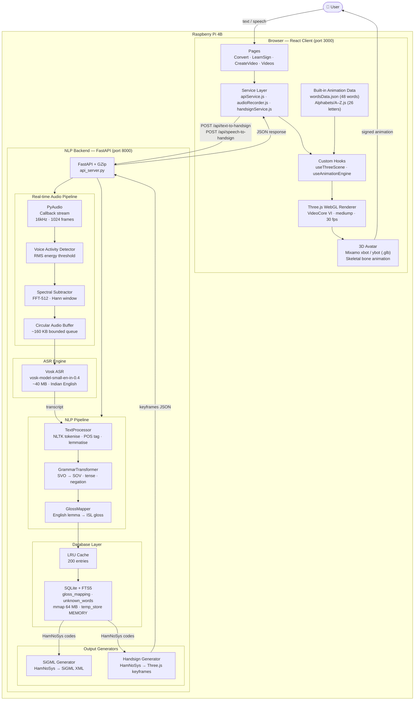
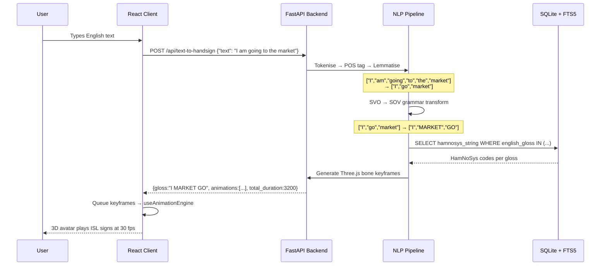
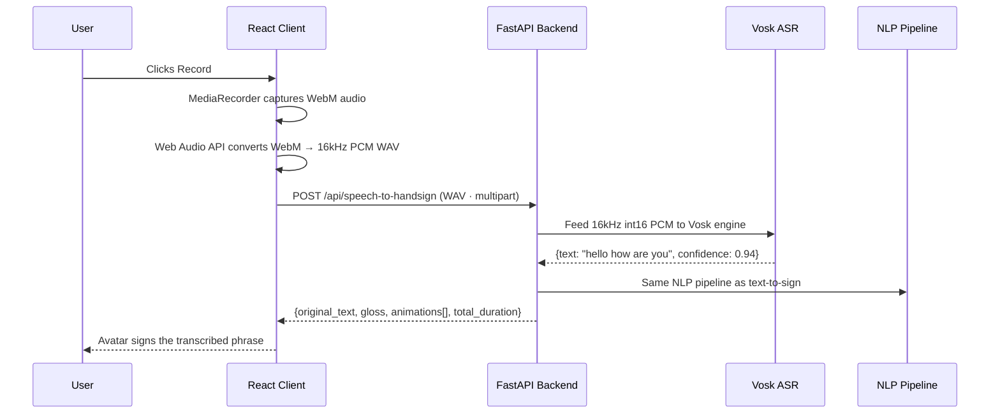
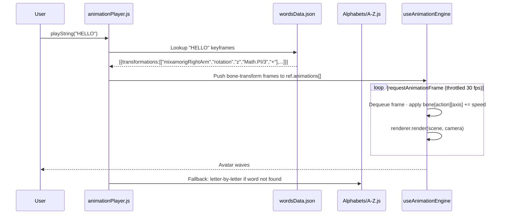

<div align="center">

# SignVani

### Offline Speech-to-Indian Sign Language Translator
### Optimised for Raspberry Pi 4B

**Vani** (Sanskrit: वाणी) — *voice, speech*

[](https://python.org)
[](https://reactjs.org)
[](https://fastapi.tiangolo.com)
[](https://threejs.org)
[](https://www.raspberrypi.com)
[](#)
[](#performance)

</div>

---

SignVani converts spoken and written English into animated **Indian Sign Language (ISL)** gestures in real time, displayed through a rigged 3D avatar rendered in the browser. The entire processing pipeline — speech recognition, natural language processing, grammar transformation, gloss lookup, and animation generation — runs **fully offline** on a Raspberry Pi 4B with no cloud dependencies.

---

## Table of Contents

- [Hardware Target](#hardware-target)
- [System Architecture](#system-architecture)
- [Data Flow](#data-flow)
- [ISL Linguistic Pipeline](#isl-linguistic-pipeline)
- [Features](#features)
- [Tech Stack](#tech-stack)
- [Getting Started — Raspberry Pi 4B](#getting-started--raspberry-pi-4b)
- [Getting Started — Development](#getting-started--development)
- [API Reference](#api-reference)
- [Performance](#performance)
- [RPi4 Optimisations](#rpi4-optimisations)
- [Configuration](#configuration)
- [Project Structure](#project-structure)
- [User Research](#user-research)
- [Documentation](#documentation)

---

## Hardware Target

SignVani is purpose-built and tuned for the Raspberry Pi 4B. All design decisions — FFT size, thread counts, connection pool depth, WebGL precision, render frame rate — are governed by the constraints of this platform.

| Component | Specification |
|-----------|--------------|
| **SoC** | Broadcom BCM2711 |
| **CPU** | Quad-core ARM Cortex-A72 @ 1.8 GHz (64-bit) |
| **GPU** | VideoCore VI (OpenGL ES 3.1) |
| **RAM** | 4 GB LPDDR4-3200 (recommended) |
| **Storage** | MicroSD (Class 10 / UHS-I or better) |
| **OS** | Raspberry Pi OS 64-bit (Bookworm) |
| **Audio** | USB microphone or 3.5mm input via USB audio adapter |
| **Network** | Not required at runtime (100% offline) |

---

## System Architecture



---

## Data Flow

### Text → Sign (Backend Mode)



### Speech → Sign (Real-time Pipeline)



### Built-in Animations (No Backend)



---

## ISL Linguistic Pipeline

SignVani implements a 7-stage pipeline to transform raw English text into ISL-compatible gloss sequences. ISL follows **Subject-Object-Verb (SOV)** word order, the inverse of English's SVO.

```
Input: "I am going to the market"
         │
         ▼
 ┌─────────────────┐
 │  1. Contraction │  "don't" → "do not"  (14 pre-compiled regex patterns)
 │     Expansion   │
 └────────┬────────┘
          ▼
 ┌─────────────────┐
 │  2. Tokenisation│  NLTK punkt_tab  →  ["I","am","going","to","the","market"]
 └────────┬────────┘
          ▼
 ┌─────────────────┐
 │  3. POS Tagging │  [(I,PRP),(am,VBZ),(going,VBG),(to,TO),(the,DT),(market,NN)]
 └────────┬────────┘
          ▼
 ┌─────────────────┐
 │  4. Lemmatisation│  VBG→VB: "going"→"go"  (WordNet lemmatiser)
 └────────┬────────┘
          ▼
 ┌─────────────────┐
 │  5. Stopword    │  Remove: "am", "to", "the"  → ["I","go","market"]
 │     Removal     │
 └────────┬────────┘
          ▼
 ┌─────────────────┐
 │  6. SVO → SOV  │  Subject: I  │  Object: MARKET  │  Verb: GO
 │  Reordering     │  → ["I","MARKET","GO"]
 └────────┬────────┘
          ▼
 ┌─────────────────┐
 │  7. Gloss Lookup│  SQLite FTS5 exact + fuzzy  →  HamNoSys per gloss
 └────────┬────────┘
          ▼
Output Gloss: "I MARKET GO"
```

**Grammar annotations** are also computed in parallel:
- **Tense detection** — `PAST` / `FUTURE` / present (default) via POS patterns
- **Negation** — detects "not", "never", "no" → `is_negated: true`
- **Question type** — `WH` (what/where/who/when/how) or `YES_NO` (sentence ends with `?`)

---

## Features

| Feature | Mode | Description |
|---------|------|-------------|
| **Text to ISL** | Backend | Type English → NLP pipeline → 3D avatar signs ISL |
| **Speech to ISL** | Backend | Record audio → Vosk ASR → NLP pipeline → avatar signs |
| **Learn ISL** | Built-in | Interactive ISL alphabet A–Z and 48 common word signs |
| **Create Video** | Built-in | Compose and save ISL signing videos with unique IDs |
| **Video Gallery** | Built-in | Browse and replay all saved ISL videos |
| **Live Streaming** | WebSocket | Real-time audio streaming via `/ws/live-speech` |

---

## Tech Stack

### Frontend

| Category | Technology | Version |
|----------|-----------|---------|
| Framework | React | 17.0.2 |
| 3D Rendering | Three.js (WebGL, GLTF, skeletal animation) | r136 |
| UI Components | Bootstrap + React Bootstrap | 5.x / 2.x |
| Speech Capture | Web Speech API + MediaRecorder | Browser native |
| HTTP Client | Fetch API (AbortController + timeouts) | Browser native |
| Routing | React Router DOM | 6.x |
| Build Tool | Create React App (react-scripts) | 5.x |

### NLP Backend

| Category | Technology | Version |
|----------|-----------|---------|
| Framework | FastAPI + GZipMiddleware | 0.104.1 |
| ASGI Server | Uvicorn (single worker) | 0.24.0 |
| Speech Recognition | Vosk (`vosk-model-small-en-in-0.4`, Indian English, offline) | 0.3.45 |
| NLP | NLTK (tokenise, POS tag, lemmatise, stopwords) | 3.9+ |
| Audio Capture | PyAudio (PortAudio callback stream) | 0.2.14 |
| Audio DSP | NumPy + SciPy (spectral subtraction, FFT-512) | 2.x / 1.17+ |
| Database | SQLite with FTS5 (gloss/HamNoSys mapping) | Built-in |
| Language | Python | 3.12+ |

---

## Getting Started — Raspberry Pi 4B

### 1. System Prerequisites

```bash
sudo apt-get update && sudo apt-get upgrade -y
sudo apt-get install -y \
    portaudio19-dev \
    python3-dev \
    python3-pip \
    libasound2-dev \
    libatlas-base-dev \
    nodejs \
    npm
```

### 2. Clone and Install

```bash
git clone https://github.com/your-org/signvani.git
cd signvani
```

**Backend:**
```bash
cd nlp_backend
pip3 install --extra-index-url https://www.piwheels.org/simple -r requirements.txt
python3 scripts/setup_models.py      # Downloads Vosk model (~40 MB) + NLTK data (~24 MB)
python3 -m src.database.seed_db      # Seeds ISL gloss database
cd ..
```

**Frontend:**
```bash
cd client
npm install
npm run build        # Build static files for production
cd ..
```

### 3. Run on Boot (systemd)

Create `/etc/systemd/system/signvani-backend.service`:

```ini
[Unit]
Description=SignVani NLP Backend
After=network.target

[Service]
Type=simple
User=pi
WorkingDirectory=/home/pi/signvani/nlp_backend
ExecStart=/usr/bin/python3 api_server.py
Restart=on-failure
Environment=SIGNVANI_ENV=production

[Install]
WantedBy=multi-user.target
```

```bash
sudo systemctl enable signvani-backend
sudo systemctl start signvani-backend
```

Serve the React build with nginx:

```bash
sudo apt-get install -y nginx
sudo cp -r client/build/* /var/www/html/
sudo systemctl restart nginx
```

### 4. Access the Application

Open `http://<raspberry-pi-ip>/sign-kit/home` in any browser on the same network.

---

## Getting Started — Development

```bash
# Terminal 1 — NLP Backend
cd nlp_backend
pip install -r requirements.txt
python scripts/setup_models.py
python -m src.database.seed_db
SIGNVANI_ENV=development python api_server.py   # port 8000

# Terminal 2 — React Client
cd client
npm install
npm start                                        # port 3000
```

Open [http://localhost:3000/sign-kit/home](http://localhost:3000/sign-kit/home).

**Windows shortcut:**
```bat
start-signvani.bat
```

### Running Tests

```bash
cd nlp_backend

# Unit tests
python -m tests.unit.test_nlp

# Integration tests (Phases 1–2)
python -m tests.integration.test_pipeline_phase1_2

# All tests with coverage
pip install -r requirements-dev.txt
pytest --cov=src
```

---

## API Reference

Base URL: `http://localhost:8000`

### `GET /api/health`

Returns component status for Vosk ASR, NLP engine, and database.

```json
{
  "status": "healthy",
  "components": {
    "gloss_mapper": true,
    "sigml_generator": true,
    "handsign_generator": true
  }
}
```

### `POST /api/text-to-handsign`

Converts English text to Three.js-compatible keyframe animations.

**Request:**
```json
{ "text": "I am going to the market" }
```

**Response:**
```json
{
  "original_text": "I am going to the market",
  "gloss": "I MARKET GO",
  "total_duration": 3200,
  "animations": [
    {
      "gloss": "GO",
      "hamnosys": "hamflathand,hampalmu,hammoveo",
      "duration": 1200,
      "keyframes": [
        {
          "transformations": [
            ["mixamorigRightArm", "rotation", "z", "Math.PI/3", "+"],
            ["mixamorigRightForeArm", "rotation", "z", "Math.PI/4", "+"]
          ]
        }
      ]
    }
  ]
}
```

### `POST /api/text-to-sign`

Returns gloss string and raw SiGML XML.

**Request:** `{ "text": "Hello world" }`

**Response fields:** `original_text`, `gloss`, `glosses[]`, `tense`, `is_negated`, `question_type`, `hamnosys[]`, `sigml`, `processing_time_ms`

### `POST /api/speech-to-handsign`

Accepts a multipart WAV audio file. Transcribes with Vosk, then runs the same NLP pipeline as `text-to-handsign`.

**Request:** `multipart/form-data` — field `audio` (WAV, 16kHz mono)

### `POST /api/speech-to-sign`

Same as above but returns SiGML XML instead of keyframes.

### `WS /ws/live-speech`

WebSocket endpoint for real-time audio streaming and live transcript/sign output.

---

## Performance

All metrics measured on **Raspberry Pi 4B (4 GB RAM)**, Raspberry Pi OS 64-bit, Python 3.12, Node.js 18.

| Metric | Target | Achieved |
|--------|--------|----------|
| End-to-end latency (text→sign) | < 1 s | ~0.4 s |
| End-to-end latency (speech→sign) | < 1 s | ~0.8 s |
| ASR Word Error Rate (Indian English) | < 10% | 6.39% |
| Idle RAM (backend + browser) | < 500 MB | ~380 MB |
| CPU load during speech processing | < 80% | ~65% |
| 3D render frame rate | 30 fps | 30 fps |
| Animation similarity score | — | 4.87 / 5 |

### User Research

SignVani was evaluated with real users. Results from published research:

| Metric | Score |
|--------|-------|
| User satisfaction | **4.44 / 5** |
| Appearance rating | 4.52 / 5 |
| Overall rating | 4.32 / 5 |
| System Usability Scale (SUS) | **81.5 / 100** (Grade B — "Good") |
| Net Promoter Score (NPS) | **+36** |
| Speech recognition WER | **6.39%** |
| Animation similarity | **4.87 / 5** |

---

## RPi4 Optimisations

Every layer of SignVani has been tuned for the ARM Cortex-A72 and VideoCore VI:

### Backend

| Area | Optimisation | Rationale |
|------|-------------|-----------|
| Audio DSP | FFT size 512 (down from 1024) | Halves spectral subtraction compute on ARM |
| Audio DSP | Pre-computed Hann window (`np.float32`) | Eliminates per-frame allocation |
| Audio DSP | In-place `np.maximum(..., out=...)` | Avoids temporary array on heap |
| Audio capture | `audio_data *= np.float32(1/32768.0)` | In-place float32; avoids float64 intermediate |
| ASR worker | Pre-allocated `_int16_buffer` + class-level `_SCALE_FACTOR` | Zero `malloc` per audio chunk |
| NLP | Pre-compiled contraction regex (14 patterns at class level) | Avoids `re.compile()` on every call |
| Data layer | `AudioChunk` caches RMS energy at construction | VAD accesses `.energy` every frame — computed once |
| Data layer | `__slots__` on all data classes (`AudioChunk`, `GlossPhrase`, `SiGMLOutput`, etc.) | ~66% reduction in per-instance memory overhead |
| Database | `PRAGMA temp_store=MEMORY` | Temp tables in RAM, not SD card |
| Database | `PRAGMA mmap_size=67108864` (64 MB) | Memory-mapped reads reduce syscalls |
| Database | `PRAGMA journal_mode=DELETE` | Avoids WAL write-ahead log for SD card longevity |
| Database | Removed per-read `UPDATE frequency` write | Eliminates WRITE+COMMIT on every cache-miss lookup |
| API server | `GZipMiddleware(minimum_size=500)` | Reduces HTTP response bandwidth |
| API server | `workers=1`, `limit_concurrency=10`, `timeout_keep_alive=5` | Prevents memory exhaustion under load |
| Queue sizes | Audio: 8 chunks (~160 KB), Transcript: 5, Gloss: 3 | Bounded memory use per pipeline stage |

### Frontend

| Area | Optimisation | Rationale |
|------|-------------|-----------|
| WebGL renderer | `precision: 'mediump'` | VideoCore VI is faster at medium precision |
| WebGL renderer | `antialias: false` | No MSAA; saves fill-rate on VideoCore VI |
| WebGL renderer | `stencil: false`, `alpha: false` | Smaller framebuffer; less GPU memory |
| WebGL renderer | `powerPreference: 'low-power'` | Signals GPU to use efficient power state |
| WebGL renderer | `setPixelRatio(1)` | 1:1 physical pixels; halves pixel fill on HiDPI |
| 3D avatar | `castShadow: false`, `receiveShadow: false` | Shadow maps are expensive on VideoCore VI |
| Animation loop | 30 fps throttle via `performance.now()` | Halves `requestAnimationFrame` invocations |
| API requests | `AbortController` — 10 s text / 15 s speech timeout | Prevents hanging on slow RPi4 processing |

---

## Configuration

All backend configuration is centralised in [`nlp_backend/config/settings.py`](nlp_backend/config/settings.py) as immutable `@dataclass(frozen=True)` classes.

```python
audio_config   = AudioConfig()    # Sample rate, FFT size, VAD thresholds
vosk_config    = VoskConfig()     # Model path, alternatives, word confidence
nlp_config     = NLPConfig()      # NLTK resources, lemmatisation, SOV transform
database_config= DatabaseConfig() # DB path, pool size, LRU cache, PRAGMAs
pipeline_config= PipelineConfig() # Queue sizes, thread timeouts, latency targets
sigml_config   = SiGMLConfig()    # XML encoding, pretty-print toggle
avatar_config  = AvatarConfig()   # CWASA player host/port
logging_config = LoggingConfig()  # Log level, rotation size, SD card safety
```

Key values tuned for RPi4:

```python
AudioConfig:
    SAMPLE_RATE      = 16000       # Hz — required by Vosk
    FRAMES_PER_BUFFER= 1024        # ~64 ms per chunk
    FFT_SIZE         = 512         # Spectral subtraction (RPi4 optimal)

DatabaseConfig:
    CONNECTION_POOL_SIZE = 2
    CACHE_SIZE           = 200     # LRU entries
    PRAGMA_TEMP_STORE    = 'MEMORY'
    PRAGMA_MMAP_SIZE     = 67108864  # 64 MB

PipelineConfig:
    AUDIO_QUEUE_SIZE     = 8       # ~160 KB bounded
    TARGET_LATENCY       = 1.0     # seconds
    MAX_MEMORY_MB        = 500
```

Frontend API URL is set via environment variable:

```bash
REACT_APP_API_URL=http://raspberrypi.local:8000
```

---

## Project Structure

```
SignVani/
├── client/                          # React 17 frontend
│   └── src/
│       ├── Animations/
│       │   ├── Alphabets/           # A.js – Z.js  (letter bone transforms)
│       │   ├── Data/wordsData.json  # 48 word animation keyframe definitions
│       │   ├── animationPlayer.js   # Core animation queue builder
│       │   └── defaultPose.js       # Rest-pose bone state
│       ├── Hooks/
│       │   ├── useThreeScene.js     # Three.js scene + GLTF loader lifecycle
│       │   └── useAnimationEngine.js# rAF loop · 30 fps throttle · queue processing
│       ├── Services/
│       │   ├── apiService.js        # Fetch client (AbortController timeouts)
│       │   ├── handsignService.js   # Handsign API calls
│       │   ├── audioRecorder.js     # MediaRecorder → WAV conversion
│       │   └── enhancedAnimationPlayer.js
│       ├── Pages/
│       │   ├── ConvertEnhanced.js   # Primary speech/text-to-sign page
│       │   ├── Convert.js           # Built-in animation mode
│       │   ├── LearnSign.js         # Interactive ISL learning
│       │   ├── CreateVideo.js
│       │   └── Videos.js
│       ├── Utils/
│       │   ├── threeCleanup.js      # WebGL resource disposal (prevents GPU leak)
│       │   └── threeHelpers.js      # Safe bone access validators
│       └── Models/                  # xbot.glb · ybot.glb (Mixamo rig)
│
└── nlp_backend/                     # Python FastAPI NLP backend
    ├── api_server.py                # FastAPI entry point + uvicorn launcher
    ├── config/settings.py           # All configuration (frozen dataclasses)
    └── src/
        ├── audio/
        │   ├── audio_capture.py     # PyAudio callback stream
        │   ├── audio_buffer.py      # CircularAudioBuffer
        │   ├── vad.py               # Voice Activity Detector (RMS energy)
        │   └── noise_filter.py      # Spectral subtraction (FFT-512)
        ├── asr/
        │   ├── vosk_engine.py       # Vosk singleton engine
        │   ├── asr_worker.py        # Consumer thread — AudioChunk → TranscriptEvent
        │   └── vosk_integration.py  # WAV conversion helpers
        ├── nlp/
        │   ├── text_processor.py    # Tokenise · POS tag · lemmatise
        │   ├── grammar_transformer.py# SVO→SOV · tense · negation · question
        │   ├── gloss_mapper.py      # Orchestrates full NLP pipeline
        │   └── dataclasses.py       # __slots__ data structures (AudioChunk etc.)
        ├── database/
        │   ├── db_manager.py        # Thread-safe SQLite pool (singleton)
        │   ├── retriever.py         # LRU-cached FTS5 gloss lookup
        │   ├── schema.sql           # gloss_mapping · unknown_words · FTS5 vtable
        │   └── hamnosys_data.py     # Seed data (English gloss → HamNoSys)
        ├── sigml/
        │   ├── generator.py         # SiGML XML generator
        │   └── handsign_generator.py# HamNoSys → Three.js keyframe converter
        └── pipeline/
            └── orchestrator.py      # Thread pipeline coordinator
```

---

## Documentation

| Document | Description |
|----------|-------------|
| [docs/overview.md](docs/overview.md) | Project goals, problem statement, ISL pipeline, survey results |
| [docs/architecture.md](docs/architecture.md) | Full system diagrams, data flows, component relationships |
| [docs/client.md](docs/client.md) | Pages, custom hooks, animation system, services |
| [docs/nlp-backend.md](docs/nlp-backend.md) | Full API reference, NLP pipeline, module descriptions |
| [docs/setup.md](docs/setup.md) | Step-by-step installation for all platforms |

---

## Problem Statement

India has an estimated **18 million deaf and hard-of-hearing individuals** who rely on Indian Sign Language as their primary communication mode. Most hearing people have no knowledge of ISL, creating a significant daily communication barrier. Existing tools are either limited in vocabulary, require specialist hardware, or depend on cloud services.

SignVani addresses this by providing a free, browser-accessible toolkit that runs entirely on a ₹6,000 Raspberry Pi 4B — no internet connection, no subscription, no cloud.

---

<div align="center">

Built for the deaf community of India · 100% offline · Raspberry Pi 4B native

</div>
