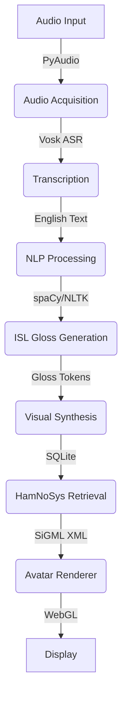

# SignVani System Architecture

## Overview

SignVani is an offline Speech-to-Sign Language conversion system designed for the Raspberry Pi 4B platform. It enables real-time translation of spoken English into Indian Sign Language (ISL) animations using a 3D avatar.

## High-Level Architecture

The system follows a sequential three-stage pipeline architecture:

## Components

### 1. Audio Acquisition Layer
- **Hardware**: 3.5mm Audio Jack with Earphone Microphone
- **Software**: PyAudio (PortAudio wrapper)
- **Processing**:
  - **Capture**: 16kHz, Mono, 16-bit PCM
  - **Noise Reduction**: Spectral subtraction algorithm to mitigate environmental noise
  - **ASR Engine**: Vosk Offline Speech Recognition (Small English Model ~40MB)
- **Output**: Raw English text string

### 2. NLP Processing Layer
- **Input**: English text
- **Pipeline**:
  1. **Tokenization**: Splitting text into words
  2. **Stop-word Removal**: Filtering auxiliary verbs (is, am, are) and prepositions
  3. **Lemmatization**: Converting words to root form (e.g., "going" -> "go")
  4. **SVO to SOV Transformation**: Rearranging sentence structure for ISL syntax
     - *Input*: Subject + Verb + Object
     - *Output*: Subject + Object + Verb
- **Output**: ISL Gloss (uppercase, space-separated)

### 3. Visual Synthesis Layer
- **Input**: ISL Gloss
- **Database**: SQLite `gloss_hamnosys_mappings` table
  - Stores mapping between Gloss words and HamNoSys (Hamburg Notation System) XML
- **SiGML Generation**: Constructing Signing Gesture Markup Language documents
- **Rendering**:
  - **Engine**: CWASA (CoffeeScript WebGL Avatar)
  - **Streaming**: Server-Sent Events (SSE) push SiGML to frontend
  - **Optimization**: Skeletal frame blending for smooth transitions

## Data Flow

1. **User speaks** into the microphone.
2. **AudioProcessor** captures audio chunks and feeds them to Vosk.
3. **Vosk** returns partial and final transcripts.
4. **NLPPipeline** processes the final transcript:
   - "I am going to the market" -> ["I", "market", "go"] -> "I MARKET GO"
5. **VisualSynthesizer** looks up "I", "MARKET", "GO" in SQLite.
6. **SiGML** is generated combining the HamNoSys for each word.
7. **FastAPI** streams the SiGML to the frontend via SSE.
8. **Frontend** (Next.js/HTML) receives SiGML and updates the 3D avatar.

## Technology Stack

| Component | Technology | Justification |
|-----------|------------|---------------|
| **Backend Framework** | FastAPI (Python) | High performance, async support, easy API definition |
| **ASR Engine** | Vosk | Offline, lightweight, ARM-optimized, low latency |
| **NLP Library** | spaCy + NLTK | Robust linguistic processing, efficient |
| **Database** | SQLite | Serverless, zero-conf, fast read performance |
| **Avatar Renderer** | WebGL (Three.js/CWASA) | Hardware accelerated graphics via VideoCore GPU |
| **Communication** | Server-Sent Events (SSE) | Efficient unidirectional real-time streaming |

## Raspberry Pi Optimization

- **Model Selection**: Using `vosk-model-small-en-us` (40MB) and `en_core_web_sm` (12MB) to fit within RAM constraints.
- **Database**: SQLite WAL mode enabled for concurrent reads/writes.
- **GPU Acceleration**: WebGL renderer leverages the Pi 4B's VideoCore VI GPU.
- **Memory Management**: Python garbage collection tuning and efficient buffer sizing.
