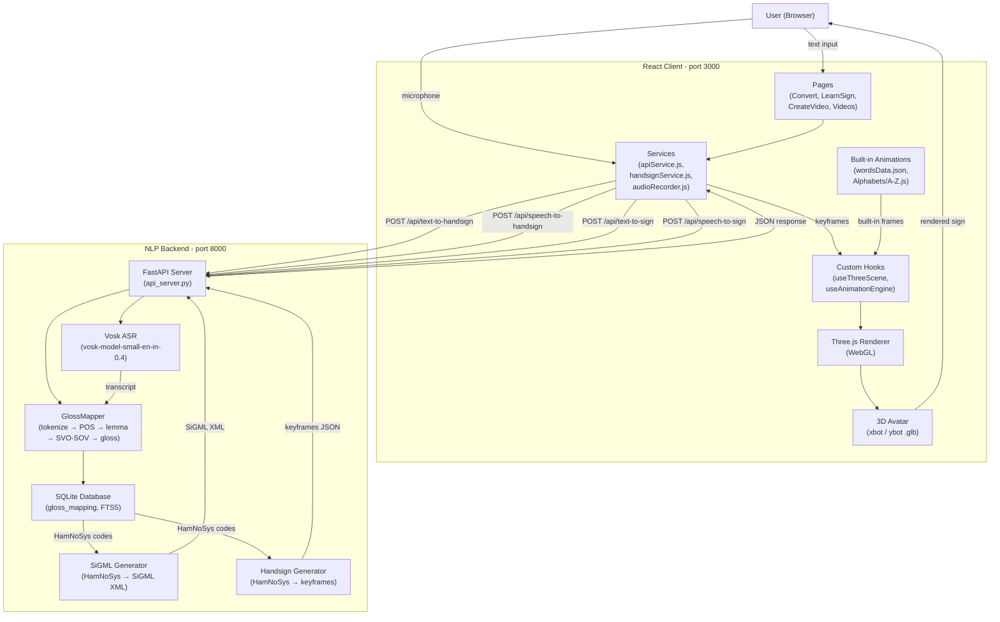
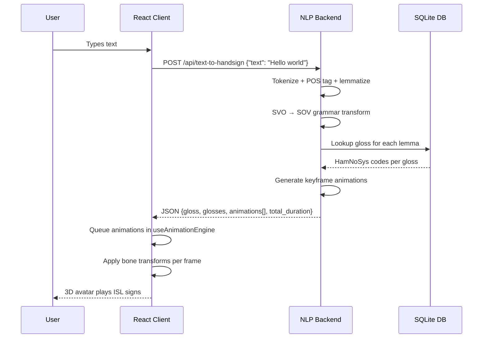
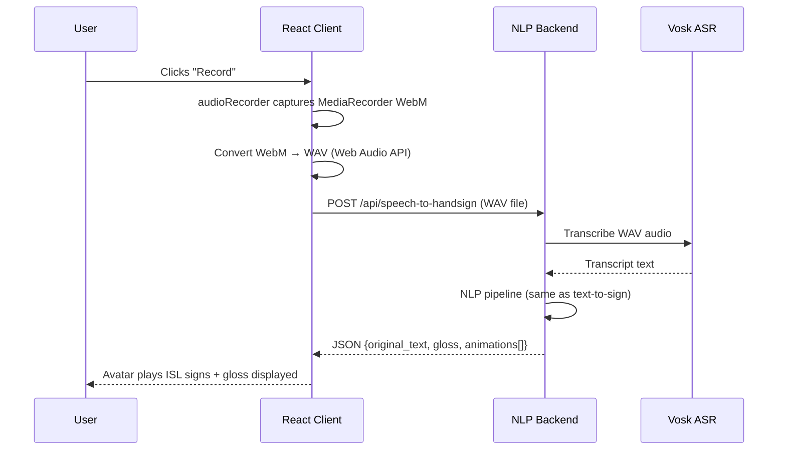
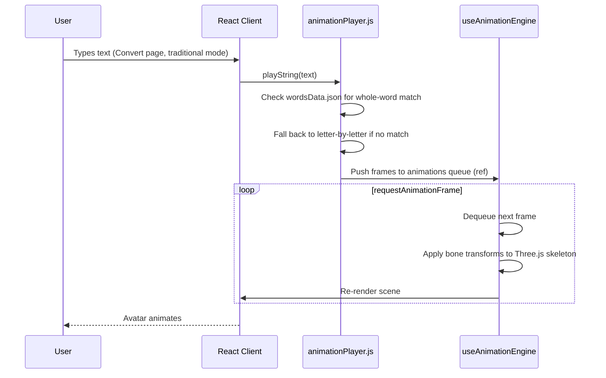
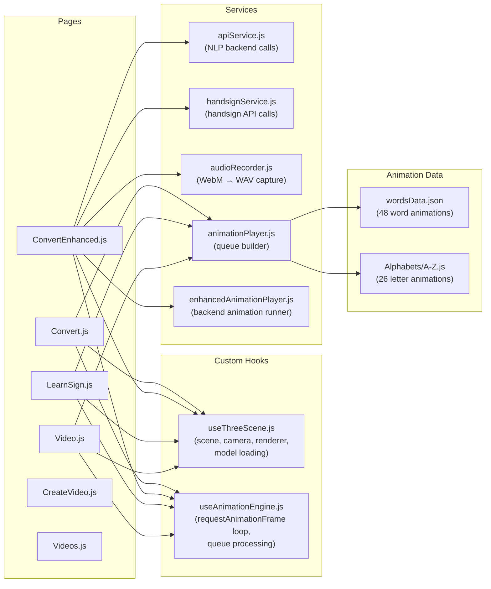

# SignVani — System Architecture

## High-Level Architecture

SignVani consists of two independent processes that communicate over HTTP:

```
┌─────────────────────────────────────────────────────────┐
│                   Browser (React App)                   │
│  ┌──────────┐  ┌──────────────┐  ┌───────────────────┐  │
│  │  UI / UX  │  │ Three.js 3D  │  │  Animation Engine  │  │
│  │  (pages,  │  │   Renderer   │  │ (bone transforms)  │  │
│  │ controls) │  │  (avatar)    │  │                   │  │
│  └──────────┘  └──────────────┘  └───────────────────┘  │
│                    ↑ bone keyframes                      │
│  ┌──────────────────────────────────────────────────┐    │
│  │              Service Layer                        │    │
│  │  apiService.js  │  handsignService.js  │  audio   │    │
│  └──────────────────────────────────────────────────┘    │
└──────────────────────┬──────────────────────────────────┘
                       │ HTTP (JSON)
                       ▼
┌─────────────────────────────────────────────────────────┐
│               NLP Backend (FastAPI, port 8000)          │
│  ┌────────────┐  ┌───────────┐  ┌────────────────────┐  │
│  │  Vosk ASR  │  │   NLTK    │  │  SQLite + FTS5 DB  │  │
│  │ (offline)  │  │ NLP pipe  │  │  (gloss/HamNoSys)  │  │
│  └────────────┘  └───────────┘  └────────────────────┘  │
│                    ↓                                     │
│  ┌────────────────────────────────────────────────────┐  │
│  │           SiGML / Animation Generator              │  │
│  └────────────────────────────────────────────────────┘  │
└─────────────────────────────────────────────────────────┘
```

---

## System Architecture Diagram



---

## Data Flow Diagrams

### Text-to-Sign Flow (Backend Mode)



### Speech-to-Sign Flow



### Built-in Animation Flow (No Backend)



---

## Component Relationships



---

## Directory Structure

```
SignVani/
├── client/                          # React frontend
│   └── src/
│       ├── Animations/
│       │   ├── Alphabets/           # A.js – Z.js (letter bone transforms)
│       │   ├── Data/
│       │   │   └── wordsData.json   # 48 word animation definitions
│       │   ├── Utils/
│       │   │   └── wordLoader.js
│       │   ├── alphabets.js
│       │   ├── animationPlayer.js   # Core animation queue builder
│       │   ├── defaultPose.js
│       │   └── words.js
│       ├── Components/
│       │   ├── Home/                # Masthead, Intro, Services
│       │   ├── CreateVideo/         # ConfirmModal
│       │   ├── Videos/              # VideoCard
│       │   ├── Navbar.js
│       │   └── Footer.js
│       ├── Config/
│       │   └── config.js            # Legacy video API base URL
│       ├── Hooks/
│       │   ├── useThreeScene.js     # Three.js scene lifecycle hook
│       │   └── useAnimationEngine.js # rAF loop + queue hook
│       ├── Models/                  # .glb avatar files (xbot, ybot)
│       ├── Pages/
│       │   ├── Home.js
│       │   ├── Convert.js
│       │   ├── ConvertEnhanced.js
│       │   ├── LearnSign.js
│       │   ├── CreateVideo.js
│       │   ├── Videos.js
│       │   ├── Video.js
│       │   └── Feedback.js
│       ├── Services/
│       │   ├── apiService.js
│       │   ├── handsignService.js
│       │   ├── enhancedAnimationPlayer.js
│       │   └── audioRecorder.js
│       ├── Utils/
│       │   ├── threeHelpers.js      # Safe bone access utilities
│       │   └── threeCleanup.js      # WebGL resource disposal
│       └── App.js                   # Router + route definitions
│
└── nlp_backend/                     # Python NLP backend
    ├── api_server.py                # FastAPI entry point
    ├── main.py                      # CLI entry point
    ├── config/
    │   └── settings.py              # All configuration (frozen dataclasses)
    ├── src/
    │   ├── pipeline/
    │   │   └── orchestrator.py      # Thread-based pipeline coordinator
    │   ├── audio/
    │   │   ├── audio_capture.py
    │   │   ├── audio_buffer.py
    │   │   ├── vad.py
    │   │   └── noise_filter.py
    │   ├── asr/
    │   │   ├── vosk_engine.py
    │   │   ├── asr_worker.py
    │   │   └── vosk_integration.py
    │   ├── nlp/
    │   │   ├── text_processor.py
    │   │   ├── grammar_transformer.py
    │   │   ├── gloss_mapper.py
    │   │   └── dataclasses.py
    │   ├── database/
    │   │   ├── db_manager.py
    │   │   ├── retriever.py
    │   │   ├── seed_db.py
    │   │   ├── schema.sql
    │   │   ├── hamnosys_data.py
    │   │   └── hamnosys_symbols.py
    │   └── sigml/
    │       ├── generator.py
    │       ├── handsign_generator.py
    │       └── avatar_player.py
    ├── scripts/
    │   ├── setup_models.py
    │   └── setup_avatar.py
    └── tests/
        ├── unit/
        └── integration/
```

---

## Deployment Topology

### Local Development

```
localhost:3000   ←→   localhost:8000
  React App           FastAPI Server
  (npm start)         (uvicorn)
```

The React app reads `REACT_APP_API_URL` at build time. If not set, it defaults to `http://localhost:8000`.

### Raspberry Pi 4 Deployment

Both processes run on the same Raspberry Pi 4 device:

```
RPi4 (LAN/WiFi)
├── port 3000 — React dev server (or static build served by nginx)
├── port 8000 — FastAPI backend (uvicorn)
└── port 8052 — CWASA SiGML Avatar Player (optional, TCP socket)
```

The `start-signvani.bat` script at the project root launches both services together.

### Legacy Cloud Deployment

The original video API (for `CreateVideo`/`Videos`/`Video` pages) uses a Heroku-hosted Node.js API:
- Base URL: `https://sign-kit-api.herokuapp.com/sign-kit`
- Configured in `client/src/Config/config.js`
