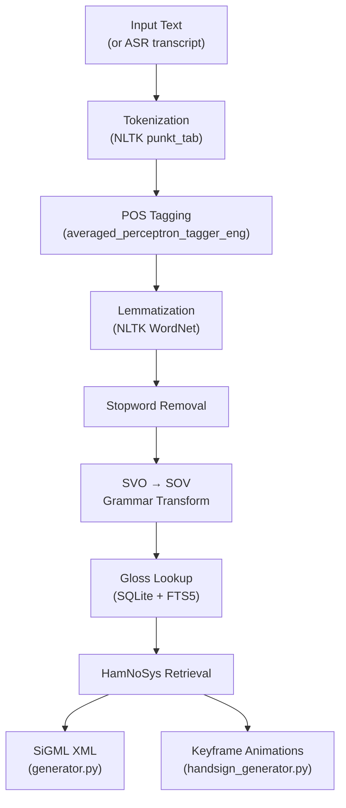

# SignVani — NLP Backend Documentation

The NLP backend is a **Python FastAPI** application located in `nlp_backend/`. It receives English text or audio from the React client, runs it through a linguistic pipeline, and returns ISL gloss sequences with optional animation keyframes or SiGML XML.

---

## Entry Points

| File | Purpose |
|---|---|
| `api_server.py` | FastAPI HTTP server — the main entry point for frontend communication |
| `main.py` | CLI tool for quick testing (`--text "Hello"`, `--seed-db`, `--verbose`) |

### Running the server

```bash
cd nlp_backend
uvicorn api_server:app --host 0.0.0.0 --port 8000 --reload
```

Or via the CLI:
```bash
python main.py --text "Hello, how are you?"
```

---

## API Reference

All endpoints are served from `http://localhost:8000` (configurable).

### `GET /`

Basic health check.

**Response:**
```json
{
  "status": "ready",
  "message": "SignVani API is running",
  "components": {
    "gloss_mapper": true,
    "sigml_generator": true,
    "pipeline_orchestrator": false
  }
}
```

---

### `GET /api/health`

Detailed component health check.

**Response:**
```json
{
  "status": "healthy",
  "components": {
    "gloss_mapper": true,
    "sigml_generator": true,
    "pipeline_orchestrator": false,
    "handsign_generator": true
  },
  "endpoints": {
    "text_to_sign": "/api/text-to-sign",
    "speech_to_sign": "/api/speech-to-sign",
    "text_to_handsign": "/api/text-to-handsign",
    "speech_to_handsign": "/api/speech-to-handsign",
    "live_speech": "/ws/live-speech"
  }
}
```

---

### `POST /api/text-to-sign`

Convert English text to ISL gloss + HamNoSys + SiGML XML.

**Request:**
```json
{ "text": "Hello, how are you?" }
```

**Response:**
```json
{
  "original_text": "Hello, how are you?",
  "gloss": "HELLO YOU HOW",
  "glosses": ["HELLO", "YOU", "HOW"],
  "hamnosys": ["hamflathand,hampalmu,hamchin,...", "..."],
  "sigml": "<sigml>...</sigml>",
  "processing_time_ms": 145
}
```

---

### `POST /api/speech-to-sign`

Convert speech audio to ISL gloss + HamNoSys + SiGML XML.

**Request:** `multipart/form-data` with an `audio` file field (WAV preferred).

**Response:** Same format as `/api/text-to-sign`, with `original_text` set to the ASR transcript.

---

### `POST /api/text-to-handsign`

Convert English text directly to **frontend-compatible keyframe animations**.

This is the primary endpoint used by `ConvertEnhanced.js`. It bypasses SiGML XML generation and produces animation data that can be fed directly into the Three.js animation engine.

**Request:**
```json
{ "text": "Hello, how are you?" }
```

**Response:**
```json
{
  "original_text": "Hello, how are you?",
  "gloss": "HELLO YOU HOW",
  "glosses": ["HELLO", "YOU", "HOW"],
  "total_duration": 3600,
  "animations": [
    {
      "gloss": "HELLO",
      "hamnosys": "hamflathand,hampalmu,hamchin,...",
      "duration": 1200,
      "keyframes": [
        {
          "time": 0,
          "transformations": [
            ["mixamorigRightArm", "rotation", "z", "0.4", "+"],
            ["mixamorigRightForeArm", "rotation", "y", "-0.3", "="]
          ]
        },
        {
          "time": 400,
          "transformations": [...]
        }
      ]
    },
    ...
  ]
}
```

**Keyframe transformation tuple format:**  
`[bone_name, transform_type, axis, value, operation]`

| Field | Values |
|---|---|
| `bone_name` | Mixamo rig bone name (e.g., `"mixamorigRightArm"`) |
| `transform_type` | `"rotation"`, `"position"`, `"scale"` |
| `axis` | `"x"`, `"y"`, `"z"` |
| `value` | Numeric string (radians for rotation) |
| `operation` | `"+"` (additive), `"="` (absolute set) |

---

### `POST /api/speech-to-handsign`

Convert speech audio to keyframe animations.

**Request:** `multipart/form-data` with an `audio` file field.

**Response:** Same format as `/api/text-to-handsign`, with `original_text` set to the ASR transcript.

---

### `WS /ws/live-speech`

WebSocket endpoint for real-time streaming speech. **Currently a placeholder** — receives audio chunks and returns status messages. Full streaming ASR integration is not yet implemented.

---

## NLP Processing Pipeline



### Step-by-step

1. **Tokenization** (`text_processor.py`)  
   Splits input text into word tokens using NLTK's `punkt_tab` tokenizer.

2. **POS Tagging** (`text_processor.py`)  
   Tags each token with its part of speech using `averaged_perceptron_tagger_eng`. This drives lemmatization and grammar transformation decisions.

3. **Lemmatization** (`text_processor.py`)  
   Reduces inflected words to their base form using NLTK's `WordNetLemmatizer` (e.g., "running" → "run", "better" → "good").

4. **Stopword Removal**  
   Filters out English stopwords (articles, prepositions, etc.) that do not have corresponding ISL signs.

5. **SVO → SOV Transformation** (`grammar_transformer.py`)  
   English uses Subject-Verb-Object word order; ISL uses Subject-Object-Verb. A rule-based transformer reorders the token sequence using POS tag patterns.

6. **Gloss Mapping** (`gloss_mapper.py`)  
   Maps each processed token to an ISL gloss (uppercase label). Lookup order:
   - Exact match in `gloss_mapping` SQLite table
   - FTS5 fuzzy match (handles spelling variations)
   - Fingerspelling fallback (letter-by-letter)

7. **HamNoSys Retrieval** (`retriever.py`)  
   For each gloss, retrieves the HamNoSys phonological notation string from the database. Results are LRU-cached (100 entries, ~32,000× speedup for repeated lookups).

8. **Output Generation**  
   - `generator.py` wraps HamNoSys codes in SiGML XML
   - `handsign_generator.py` converts HamNoSys codes into Three.js-compatible bone keyframes

---

## Modules Reference

### `config/settings.py`

All configuration is defined as **frozen dataclasses** (immutable at runtime) and accessed via module-level singletons.

| Config class | Key settings |
|---|---|
| `AudioConfig` | 16kHz sample rate, VAD energy threshold (0.02), FFT size (1024) |
| `VoskConfig` | Model: `vosk-model-small-en-in-0.4`, model path |
| `NLPConfig` | NLTK data path, SVO→SOV enabled, min token length (2) |
| `DatabaseConfig` | DB path (`data/signvani.db`), pool size (3), LRU cache (100), FTS enabled |
| `PipelineConfig` | Queue sizes, thread timeout (5s), target latency (<1s), max memory (500MB) |
| `SiGMLConfig` | XML encoding (UTF-8), pretty print off |
| `AvatarConfig` | CWASA player host/port (localhost:8052), TCP connection timeout |
| `LoggingConfig` | Max log size (10MB), 3 backups, INFO level |

---

### `src/pipeline/orchestrator.py`

The `PipelineOrchestrator` coordinates all processing stages as separate threads connected by queues.

Thread topology:
```
AudioCaptureThread → [audio_queue] → ASRWorkerThread → [transcript_queue]
  → NLPThread → [gloss_queue] → SiGMLThread → Output
```

Used by `main.py` for CLI operation and real-time audio processing. Not active in the API server (which processes requests synchronously).

---

### `src/audio/`

| Module | Purpose |
|---|---|
| `audio_capture.py` | PyAudio stream capture with VAD gating and noise reduction |
| `audio_buffer.py` | Thread-safe circular buffer for audio chunks |
| `vad.py` | Energy-based Voice Activity Detection — only passes audio frames above the energy threshold |
| `noise_filter.py` | Spectral subtraction noise reduction (FFT-based) |

---

### `src/asr/`

| Module | Purpose |
|---|---|
| `vosk_engine.py` | Thread-safe singleton wrapper around the Vosk recognizer |
| `asr_worker.py` | Worker thread that feeds audio chunks to Vosk and emits transcript events |
| `vosk_integration.py` | Utilities used by `api_server.py`: `get_asr_engine()`, `convert_to_wav()` |

**Vosk model used:** `vosk-model-small-en-in-0.4`  
- Offline, Indian English accent-optimized
- ~40MB download
- ~200ms transcription latency per utterance

---

### `src/nlp/`

| Module | Purpose |
|---|---|
| `text_processor.py` | Tokenization, POS tagging, lemmatization |
| `grammar_transformer.py` | Rule-based SVO → SOV reordering |
| `gloss_mapper.py` | Orchestrates the full NLP pipeline from text to `GlossPhrase` |
| `dataclasses.py` | `GlossPhrase`, `SiGMLOutput` — memory-optimized with `__slots__` and `float32` |

**`GlossPhrase` fields:**

```python
@dataclass
class GlossPhrase:
    glosses: list[str]       # ["HELLO", "YOU", "HOW"]
    gloss_string: str        # "HELLO YOU HOW"
    hamnosys_map: dict       # {"HELLO": "hamflathand,...", ...}
```

---

### `src/database/`

| Module | Purpose |
|---|---|
| `db_manager.py` | Thread-safe SQLite connection pool (3 connections, singleton) |
| `retriever.py` | Gloss and HamNoSys lookup with LRU cache |
| `seed_db.py` | Populates the database from `hamnosys_data.py` |
| `schema.sql` | Table definitions |
| `hamnosys_data.py` | Source data: English word → ISL gloss → HamNoSys mapping |
| `hamnosys_symbols.py` | HamNoSys symbol reference table |

**Database schema:**

```sql
CREATE TABLE gloss_mapping (
    id INTEGER PRIMARY KEY,
    english_word TEXT NOT NULL,
    isl_gloss TEXT NOT NULL,
    hamnosys TEXT,
    category TEXT
);

CREATE VIRTUAL TABLE gloss_fts USING fts5(
    english_word, isl_gloss, content='gloss_mapping'
);

CREATE TABLE unknown_words (
    word TEXT PRIMARY KEY,
    first_seen TIMESTAMP DEFAULT CURRENT_TIMESTAMP,
    count INTEGER DEFAULT 1
);
```

FTS5 enables fuzzy matching so that unknown words can still find close gloss matches. Unknown words with no match are recorded in `unknown_words` for future vocabulary expansion.

---

### `src/sigml/`

| Module | Purpose |
|---|---|
| `generator.py` | Converts a `GlossPhrase` to SiGML XML (for CWASA avatar player) |
| `handsign_generator.py` | Converts HamNoSys codes to Three.js-compatible keyframe JSON |
| `avatar_player.py` | TCP socket client for the CWASA SiGML Player (port 8052) |

---

## Performance Targets

| Stage | Target latency |
|---|---|
| Audio buffering | ~64ms per chunk |
| ASR (Vosk) | ~200ms per utterance |
| NLP pipeline | ~10–15ms |
| DB lookup (cached) | ~0.0005ms (LRU hit) |
| DB lookup (uncached) | ~1–2ms |
| SiGML generation | <5ms |
| **Total end-to-end** | **<1000ms** |

Memory budget: 500MB total (excluding OS overhead), tuned for Raspberry Pi 4 with 2–8GB RAM.

---

## CORS Configuration

The API server allows requests from:
- `http://localhost:3000`
- `http://127.0.0.1:3000`

To allow a different frontend origin, update `allow_origins` in `api_server.py`.
