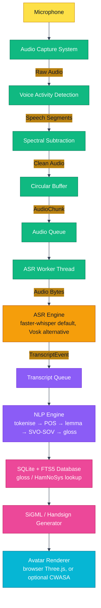

# SignVani Architecture

## Overview

SignVani is an offline, edge-computing solution designed to convert spoken English into Indian Sign Language (ISL) visual output. It targets the Raspberry Pi 4 platform and emphasizes low latency and memory efficiency.

## System Data Flow

The full pipeline — audio in, ISL animation out — is implemented end to end:

**This chain is not currently invoked by any active endpoint.** `api_server.py`'s two file-upload endpoints (`/api/speech-to-handsign`, `/api/speech-to-sign`) skip straight from an uploaded WAV to `get_asr_engine()`, bypassing `AudioCaptureSystem`/`VAD`/`SpectralSubtractor`/`CircularAudioBuffer` entirely. The `PipelineOrchestrator` that wires this diagram together is implemented but commented out at startup, and `/ws/live-speech` is a stub that never calls ASR. This diagram documents built, tested code — not the live request path.

## Core Subsystems

### 1. Audio Subsystem (`src/audio/`)

Responsible for capturing audio, detecting speech, and reducing noise. Implemented and unit-tested, but only exercised via the (currently unwired) `PipelineOrchestrator` — not by the live HTTP/WS endpoints.

* **`AudioCaptureSystem`**: Manages the PyAudio stream in non-blocking callback mode.
* **`VoiceActivityDetector`**: Uses energy thresholding to distinguish speech from silence.
* **`SpectralSubtractor`**: Performs frequency-domain noise reduction using `scipy.fft`.
* **`CircularAudioBuffer`**: A thread-safe ring buffer to store audio chunks before processing.

### 2. ASR Subsystem (`src/asr/`)

Responsible for converting audio into text. This is the one subsystem both the live-capture chain above and the active file-upload endpoints share.

* **`get_asr_engine()`** (`vosk_integration.py`): Factory that reads the `ASR_ENGINE` env var (default `faster_whisper`) and returns the active engine. This is the single point where engine selection happens.
* **`WhisperASR`** (`whisper_integration.py` / `whisper_engine.py`): Default engine — faster-whisper, `tiny.en`, int8 CTranslate2, greedy decode.
* **`VoskEngine`** (`vosk_engine.py`): Alternative engine — a singleton wrapper around the Vosk offline ASR library (`vosk-model-small-en-in-0.4`).
* **`ASRWorker` / `WhisperASRWorker`**: Background threads that consume `AudioChunk` objects from the `AudioQueue` and push `TranscriptEvent` objects to the `TranscriptQueue` — used by the live-capture chain, not by the file-upload endpoints.

### 3. NLP, Database & SiGML Subsystems (`src/nlp/`, `src/database/`, `src/sigml/`)

Built out since this document was first written — no longer "pending":

* **`src/nlp/`**: `text_processor.py` (tokenise/POS/lemmatise), `grammar_transformer.py` (SVO→SOV, tense, negation, question type), `gloss_mapper.py` (orchestrates the full text→gloss pipeline).
* **`src/database/`**: `db_manager.py` (thread-safe SQLite connection pool), `retriever.py` (LRU-cached FTS5 gloss lookup), `schema.sql` (`gloss_mapping` + FTS5 virtual table).
* **`src/sigml/`**: `handsign_generator.py` (HamNoSys → Three.js keyframes — the active rendering path) and `generator.py` (HamNoSys → SiGML XML, consumed by the optional/legacy `CWASAPlayer`).

### 4. Configuration (`config/`)

* **`settings.py`**: Uses frozen dataclasses to define immutable configuration parameters for all subsystems, including `ASR_ENGINE` selection. This ensures consistency and prevents runtime modification of critical settings.

## Data Structures (`src/nlp/dataclasses.py`)

* **`AudioChunk`**: Represents a chunk of audio data. Uses `__slots__` and `float32` for memory efficiency, and caches RMS energy at construction.
* **`TranscriptEvent`**: Represents a recognized text segment.
* **`GlossPhrase`, `SiGMLOutput`**: `__slots__`-based structures carrying gloss and animation output through the pipeline.

## Design Principles

* **Offline-First**: No dependency on cloud APIs.
* **Memory Efficiency**: Extensive use of `__slots__`, `float32`, and generators.
* **Thread Safety**: All shared resources (queues, buffers, engines) are thread-safe.
* **Latency Focused**: Processing pipelines are designed to minimize delay.
